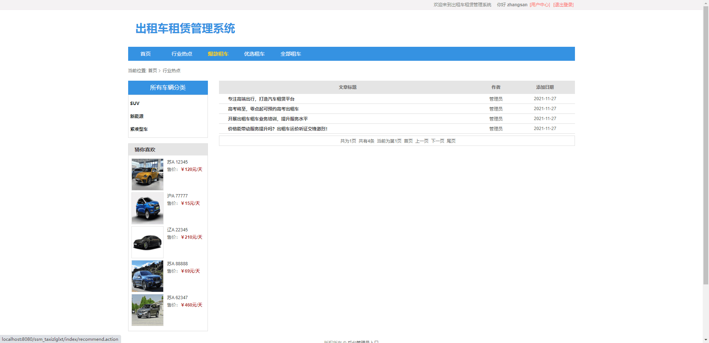
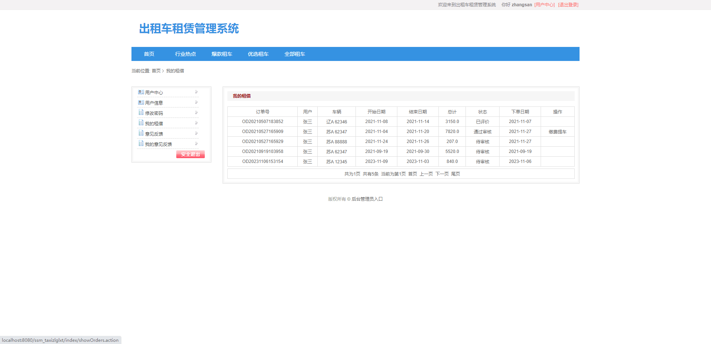
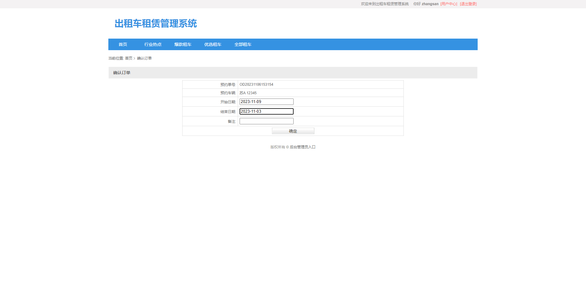
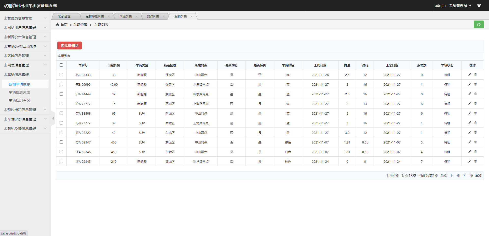

基于SSM的出租车租赁管理系统
=
### 完整代码获取地址：从戎源码网 ([https://armycodes.com/](https://armycodes.com/))
### 作者微信：19941326836  QQ：952045282 
### 承接计算机毕业设计、Java毕业设计、Python毕业设计、深度学习、机器学习
### 选题+开题报告+任务书+程序定制+安装调试+论文+答辩ppt 一条龙服务
### 所有选题地址https://github.com/nature924/allProject

一、项目介绍
---
本项目是一套基于SSM的出租车租赁管理系统，该系统共包含两种角色：用户、管理员，主要分为前台和后台两大模块。

### 
1.前台模块
前台用户界面的实现，包括：前台首页、行业热点、爆款租车、优选租车、全部租车、用户注册、用户登陆、个人中心、我的租借、意见反馈、用户信息、修改密码等功能。
###
2.后台模块
主要是管理员对网站的管理功能，包括：管理员管理、用户信息管理、新闻公告管理、车辆类型管理、区域信息管理、网点信息管理、车辆信息管理、预约出租信息管理、车辆评价信息管理、意见反馈管理等功能。

二、项目技术
---
- 编程语言：Java
- 数据库：MySQL
- 项目管理工具：Maven
- 前端技术：JSP、HTML、Jquery、Layui、ECharts
- 后端技术：Spring、SpringMVC、MyBatis

三、运行环境
---
- 操作系统：Windows、macOS都可以
- JDK版本：JDK1.8以上都可以
- 开发工具：IDEA、Ecplise、Myecplise都可以
- 数据库: MySQL5.7以上都可以
- Tomcat：任意版本都可以
- Maven：任意版本都可以

四、运行截图
---

### 程序截图：

